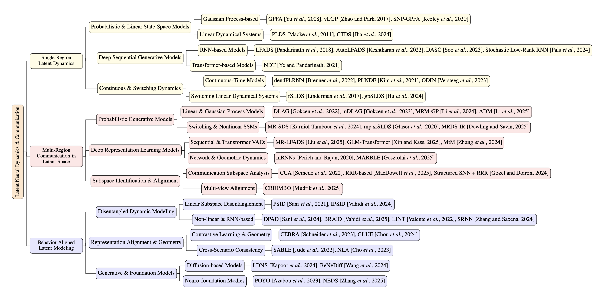

<h2>Machine Learning Methods for Studying Latent Neural Activity Dynamics</h2>

This repository contains the resources for the paper.

## Taxonomy

## 📑 List of Survey Papers

### Single-Region Latent Dynamics

- **Representation learning for neural population activity with neural data transformers**, arXiv.2108.01210 [[paper](https://arxiv.org/abs/2108.01210)]

  - **Model**: NDT
  - **Problem Setting**: This approach aims to address the temporal processing bottleneck in learning to represent neural population activity based on explicit dynamic models such as recurrent neural networks (RNNs), which impedes the speed of real-time applications.
  - **Methodology**: The NDT model adapts the Transformer architecture to infer discharge rates from noisy neural pulse sequences, replacing the sequential processing of RNNs with parallel “self-attention mechanisms.”

- **Training biologically plausible recurrent neural networks on cognitive tasks with long-term dependencies**, NeurIPS 2023 [[paper](https://proceedings.neurips.cc/paper_files/paper/2023/hash/65ccdfe02045fa0b823c5fa7ffd56b66-Abstract-Conference.html)]

  - **Model**: DASC 
  - **Problem Setting**: How to effectively train biologically plausible recurrent neural networks (RNNs) to perform complex cognitive tasks requiring the learning of long-term temporal dependencies.
  - **Methodology**: Introducing specialized time-jump connections (SCTT and DASC) as auxiliary elements during training to stabilize gradients and accelerate learning, then removing them upon training completion to restore the model's biological plausibility.

- **Tractable dendritic RNNs for reconstructing nonlinear dynamical systems**,  ICML 2022 [[paper](https://proceedings.mlr.press/v162/brenner22a.html)]

  - **Model**: dendPLRNN
  - **Problem Setting**: Addressing the challenge of inferring nonlinear dynamical systems (DS) from observed time series, particularly by overcoming the limitations of existing deep learning approaches—namely their lack of interpretability and manageability, as well as their requirement for high-dimensional latent spaces.
  - **Methodology**: By drawing inspiration from dendritic computing principles, we enhance the piecewise linear recurrent neural network (PLRNN) with dynamic interpretability and mathematical tractability through linear spline basis expansion. This leads to the construction of dend-PLRNN, enabling the approximation of arbitrary nonlinear dynamical systems in lower dimensions.

- **Disentangling the Roles of Distinct Cell Classes with Cell-Type Dynamical Systems**, NeurIPS 2024 [[paper](https://proceedings.neurips.cc/paper_files/paper/2024/hash/3b2fa36f85cda678363cc19cf62b7c5c-Abstract-Conference.html)]

  - **Model**: CTDS
  - **Problem Setting**: Addressing the issue that existing latent linear dynamic system (LDS) models neglect the presence of multiple cell types within neural circuits.
  - **Methodology**: This paper proposes the Cell Type Latent Linear Dynamical System (CTDS) model, an extension of the standard Latent Linear Dynamical System (LDS). It defines distinct sets of latent variables for each cell type (e.g., excitatory E and inhibitory I) and introduces non-negative/non-positive constraints based on Dale's law in the dynamical and emission matrices to distinguish and capture the functional roles and interactions among different cell categories.

- **Inferring Latent Dynamics Underlying Neural Population Activity via Neural Differential Equations**,  ICML 2021 [[paper](https://proceedings.mlr.press/v139/kim21h)]

  - **Model**: PLNDE
  - **Problem Setting**: Addressing the challenge of identifying the underlying dynamics behind neural population activity, particularly the lack of interpretability in existing methods (such as LFADS) when dealing with low data volumes.
  - **Methodology**: Employing Neural Ordinary Differential Equations (Neural ODEs) to construct low-dimensional nonlinear continuous-time dynamics, combined with stochastic jump mechanisms to handle noisy discrete sensory inputs, we infer interpretable phase planes and fixed points from Poisson spike sequences.

- **Inferring single-trial neural population dynamics using sequential auto-encoders**,  Nature Methods 15:805–815, 2018 [[paper](https://www.nature.com/articles/s41592-018-0109-9)]

  - **Model**: LFADS

  - **Problem Setting**: Accurately infer underlying neural population dynamics and precise instantaneous firing rates from noisy single-trial neural spike data.

  - **Methodology**: Potential Factor Analysis via Dynamic Systems: A Deep Learning Approach Based on Nonlinear Recurrent Neural Networks (RNNs), a Sequential Variant of Variational Autoencoders (VAEs). This method builds upon the concept that neural data can be generated by dynamic systems, inferring neural population dynamics in a single trial by modeling the latent dynamic state, initial conditions, and inputs of neural activity.

- **Empirical models of spiking in neural populations**, NIPS 2011 [[paper](https://proceedings.neurips.cc/paper_files/paper/2011/hash/7143d7fbadfa4693b9eec507d9d37443-Abstract.html)]

  - **Model**: PLDS

  - **Problem Setting**: Addressing the question of selecting a more appropriate statistical model for concurrent spiking activity in cortical neuronal populations: in multi-neuron simultaneous recordings, should we employ a “directly coupled GLM” or a “low-dimensional latent variable + dynamic system” to more accurately explain the shared variability in simultaneous discharges among cortical neurons?

  - **Methodology**: Constructing the Poisson-Linac Dynamic System (PLDS) as a latent dynamic model, and learning its parameters using the Expectation-Maximization (EM) algorithm combined with a global Laplace approximation.

- **Gaussian-process factor analysis for low-dimensional single-trial analysis of neural population activity**, NIPS 2008 [[paper](https://proceedings.neurips.cc/paper/2008/hash/ad972f10e0800b49d76fed33a21f6698-Abstract.html)]

  - **Model**: GPFA

  - **Problem Setting**: How to extract smooth, low-dimensional neural trajectories from high-noise, high-dimensional neural population activity in a single experiment to more accurately characterize neural dynamics and overcome the limitations of traditional two-step dimensionality reduction methods.

  - **Methodology**: The GPFA approach unifies time smoothing (Gaussian process) and low-dimensional reduction (factor analysis) within a probabilistic framework, simultaneously modeling neural noise and multi-timescale dynamics to extract smooth, low-dimensional neural trajectories from high-dimensional neural data obtained from a single trial.

- **Variational latent gaussian process for recovering single-trial dynamics from population spike trains**, Neural Computation 29(5):1293–1316, 2017[[paper](https://direct.mit.edu/neco/article-abstract/29/5/1293/8259/Variational-Latent-Gaussian-Process-for-Recovering)]

  - **Model**: vLGP

  - **Problem Setting**: How to extract low-dimensional latent dynamics from large-scale neural population activity while maintaining interpretability, and capture the interactive relationships between different brain regions.

  - **Methodology**: Based on GPFA, we infer low-dimensional continuous latent states from multi-neuron activity by treating neural activity as observational data generated by latent continuous trajectories. We approximate the posterior distribution via variational inference that maximizes the lower bound of marginal likelihood (ELBO), while employing an incomplete Cholesky decomposition to optimize computational complexity. This approach enables the recovery of single-trial latent neural dynamics from population spike sequences.

- **A large-scale neural network training framework for generalized estimation of single-trial population dynamics**, Nature Methods 19:1572–1577, 2022 [[paper](https://www.nature.com/articles/s41592-022-01675-0)]

  - **Model**: AutoLFADS

  - **Problem Setting**: Neuroscience research requires accurately estimating low-dimensional, smoothed single-trial neural population dynamics from noisy, high-dimensional neural spike data.Existing methods (e.g., LFADS) are effective but heavily rely on time-consuming manual hyperparameter tuning during training. This results in inefficient model training and hinders generalization to new datasets or tasks, impeding the universal and large-scale estimation of neural dynamics.This paper aims to address these efficiency and generalization challenges by developing an automated framework.

  - **Methodology**: AutoLFADS: An unsupervised automated model tuning framework based on the LFADS architecture;Introduces Coordinated Dropout to prevent identity overfitting;Employs Population-Based Training for large-scale hyperparameter search and dynamic optimization;Supports multiple brain regions, task types, and neural signal modalities (e.g., spike counts, LFP, calcium imaging, etc.).

- **Bayesian learning and inference in recurrent switching linear dynamical systems**, AISTATS 2017 [[paper](https://proceedings.mlr.press/v54/linderman17a.html)]

  - **Model**: rSLDS

  - **Problem Setting**: In traditional Switching Linear Dynamic Systems (SLDS), transitions between discrete states depend solely on the preceding discrete state, making it impossible to model the influence of continuous states or external inputs on system behavior switching.To enhance modeling capabilities for behavioral pattern switching in complex time series—such as neuronal discharges or basketball trajectories—more flexible models must be constructed. These models enable discrete state transitions to depend on continuous latent variables or observations.

  - **Methodology**: Propose a recursive switching linear dynamic system that allows discrete state transitions to depend on continuous latent states or external inputs, using stick-breaking logistic regression to model transition probabilities.Introduce Polya-gamma auxiliary variables to transform non-Gaussian logistic likelihoods into conditional Gaussian forms, enabling block Gibbs sampling and variational inference.Developed an efficient message-passing sampling algorithm to achieve joint posterior sampling over continuous and discrete latent states.Validated the model across multiple synthetic and real-world datasets, including basketball player trajectory analysis.

- **Modeling Latent Neural Dynamics with Gaussian Process Switching Linear Dynamical Systems**, NeurIPS 2024 [[paper](https://arxiv.org/abs/2408.03330)]

  - **Model**: gpSLDS

  - **Problem Setting**: Under conditions of limited data and a desire for interpretability, recover smooth and structured nonlinear latent dynamics from neural time series while simultaneously providing uncertainty estimates for the learned dynamics (e.g., determining whether fixed points/attractors are credible). Additionally, address the issue of rSLDS generating “unnatural oscillations” at boundaries.

  - **Methodology**: We propose Gaussian Process Switching Linear Dynamical Systems (gpSLDS), a novel method for inferring low-dimensional latent dynamics from high-dimensional neural data. At its core lies an innovative Smooth Switching Linear (SSL) kernel function, designed as the prior for the dynamics function in Gaussian Process Stochastic Differential Equations (GP-SDEs). The key feature of this kernel lies in its ability to generate smoothly varying, locally linear dynamics. This effect is analogous to defining multiple linear dynamic regions within the latent space, but with smooth transitions between these regions rather than the abrupt switching observed in traditional rSLDS models. Thus, gpSLDS successfully combines the interpretability of rSLDS with the flexibility and uncertainty quantification capabilities of GP-SDE, while overcoming the oscillatory artifacts near switching boundaries inherent in rSLDS. This enables more reliable identification of key features in neural dynamics, such as fixed points and attractors.

- **Expressive dynamics models with nonlinear injective readouts enable reliable recovery of latent features from neural activity**,  arXiv:2309.06402v1 [[paper](https://pmc.ncbi.nlm.nih.gov/articles/PMC10516113/)]

  - **Model**: ODIN

  - **Problem Setting**: Addressing the issue of non-injectivity in the mapping between latent space and neural space within neurodynamic models, which renders latent dynamic representations non-interpretable.

  - **Methodology**: The model employs neural ordinary differential equations (Neural ODEs) to describe the evolution of latent states over time. It maps the latent space to the neural space through a structure analogous to a reversible residual network. End-to-end training is performed by maximizing the likelihood of observed neural activity (Poisson NLL), while simultaneously preserving the stability and injectivity of the mapping.

- **Inferring stochastic low-rank recurrent neural networks from neural data**, NeurIPS 2024 [[paper](https://arxiv.org/abs/2406.16749)]

  - **Model**: SLRNN

  - **Problem Setting**: How to better fit random low-rank recurrent neural networks to noisy neural data containing underlying stochastic systems, thereby capturing the inherent inter-trial variability inherent in neural data. For low-rank models with piecewise linear nonlinearities, how to efficiently analyze their dynamic systems, specifically by demonstrating a method to identify all fixed points with polynomial complexity in the number of neurons (N) rather than exponential complexity.

  - **Methodology**: This paper proposes the Variational Sequential Monte Carlo (VSMC) method for fitting stochastic low-rank recurrent neural networks (RNNs). This approach models low-rank RNNs as nonlinear latent dynamical systems (i.e., state-space models), learns model parameters by maximizing a variational objective (ELBO), and approximates the posterior distribution of latent states using particle trajectories. Furthermore, this method provides an efficient analytical approach capable of computing all fixed points of low-rank RNNs with piecewise linear activation functions at polynomial cost, making dynamic system analysis feasible for large-scale networks.

- **Identifying signal and noise structure in neural population activity with Gaussian process factor models**, NeurIPS 2020 [[paper](https://proceedings.neurips.cc/paper_files/paper/2020/hash/9eed867b73ab1eab60583c9d4a789b1b-Abstract.html)]

  - **Model**: SNP-GPFA

  - **Problem Setting**: In neural population data from repeated trials, how can we simultaneously and clearly separate the “signal” structure locked to the stimulus from the “noise” structure arising from random fluctuations between trials?

  - **Methodology**: We propose a “signal-noise” latent variable framework (SNP-GPFA) that combines Gaussian process factor models (GPFA) with Poisson observations. By employing Fourier-domain black-box variational inference, we efficiently estimate both the shared signal latent variable and the trial-specific noise latent variable, thereby separating signal and noise structures in neural activity.

### Multi-Region Communication in Latent Space

- **Disentangling the flow of signals between populations of neurons**, Nature Computational Science 2022 [[paper](https://www.nature.com/articles/s43588-022-00282-5)]

  - **Model**: DLAG
  - **Problem Setting**: How to decouple simultaneous, bidirectional inter-brain-region signal flows from the activity of large populations of neurons recorded concurrently.
  - **Methodology**: Based on a probabilistic framework utilizing Gaussian processes and linear dimensionality reduction, it employs classical methods from statistics and machine learning to effectively decouple and analyze bidirectional signal flows between neuronal populations.

- **Multi-Region Markovian Gaussian Process: An Efficient Method to Discover Directional Communications Across Multiple Brain Regions**, ICML 2024 [[paper](https://pmc.ncbi.nlm.nih.gov/articles/PMC11526605/)]

  - **Model**: MRM-GP

  - **Problem Setting**: Addressing the challenge of efficiently and interpretably identifying directional communication within high-dimensional neural activity across multiple brain regions recorded simultaneously.

  - **Methodology**: Combining two traditional probabilistic models—Gaussian processes and linear dynamic systems—to enhance efficiency and interpretability.

- **Uncovering motifs of concurrent signaling across multiple neuronal populations**, NeurIPS 2023 [[paper](https://proceedings.neurips.cc/paper_files/paper/2023/hash/6cf7a37e761f55b642cf0939b4c64bb8-Abstract-Conference.html)]

  - **Model**: mDLAG

  - **Problem Setting**: How to characterize and decouple multidimensional, concurrent signal flows from the simultaneous activity of multiple (more than two) neuronal populations.

  - **Methodology**: Multi-brain-region version of DLAG.

- **NONLINEAR MULTIREGION NEURAL DYNAMICS WITH PARAMETRIC IMPULSE RESPONSE COMMUNICATION CHANNELS**, ICLR 2025 [[paper](https://openreview.net/forum?id=LbgIZpSUCe)]

  - **Model**: MRDS-IR

  - **Problem Setting**: Although technological advances have made it possible to simultaneously record neural activity across multiple brain regions, how do we understand how these regions collectively support distributed computation and extract interpretable dynamic structures from the recorded data?

  - **Methodology**: Combining nonlinear local dynamics with linear communication channels parameterized by impulse response.

- **CREIMBO: Cross-Regional Ensemble Interactions in Multi-view Brain Observations**, ICLR 2025 [[paper](https://par.nsf.gov/biblio/10616080)]

  - **Model**: CREIMBO

  - **Problem Setting**: How to integrate large-scale neural recording data that is non-simultaneous and non-aligned across different subjects and sessions.

  - **Methodology**: Multi-perspective learning + shared subcircuit hypothesis. Aligning cross-session neuronal functional ensembles through graph-driven dictionary learning.

- **Modeling state-dependent communication between brain regions with switching nonlinear dynamical systems**, ICLR 2024 [[paper](https://openreview.net/forum?id=WQwV7Y8qwa)]

  - **Model**: MR-SDS
  - **Problem Setting**: How to model complex, state-dependent interactions between multiple brain regions. (Emphasis on interpretability)

  - **Methodology**: Introducing the concepts of discrete states and quantifiable “messages” to analyze directed information flows between brain regions.

- **Learning Time-Varying Multi-Region Brain Communications via Scalable Markovian Gaussian Processes**, ICML 2025 [[paper](https://openreview.net/forum?id=pOAEfqa26i)]

  - **Model**: ADM
  - **Problem Setting**: Existing methods struggle to capture communication patterns and temporal delays across multiple brain regions over time. Computational efficiency remains low for large-scale datasets.

  - **Methodology**: Establish a universal connection between arbitrary-time-stationary Gaussian processes (GP) and state-space models (SSM), enabling the model to combine the expressive power of GP with the computational efficiency of SSM. Introduce continuous time-varying delay parameters into the model to capture the dynamic communication patterns and directions between brain regions.

- **Accurate Identification of Communication Between Multiple Interacting Neural Populations**, ICML 2025 [[paper](https://arxiv.org/abs/2506.19094)]

  - **Model**: MR-LFADS
  - **Problem Setting**: Existing models struggle to accurately distinguish and identify the influence of different sources on local neural group activity when analyzing multi-brain-region neural recordings, leading to inaccurate descriptions of inter-brain communication.

  - **Methodology**: This is a Sequential Variational Autoencoder (SVAE), an extension of the renowned LFADS model. MR-LFADS introduces a specific latent variable structure to disentangle three distinct sources of influence: inter-region communication, input from unobserved regions, and local neural group dynamics.

- **MARBLE: interpretable representations of neural population dynamics using geometric deep learning**, Nature Methods 22:612–620, 2025 [[paper](https://www.nature.com/articles/s41592-024-02582-2)]

  - **Model**: MARBLE
  - **Problem Setting**: Extracting interpretable and consistent latent dynamical representations from high-dimensional neural data enables reliable comparisons and decoding of nonlinear neural dynamics across different conditions and systems (animals or neural networks) without relying on behavioral supervision.

  - **Methodology**: The properties of neural swarm dynamics unfolded on low-dimensional manifolds decompose high-dimensional dynamics into local flow fields (LFFs) encoding local dynamic information. These LFFs are then mapped to a shared latent space using an unsupervised geometric deep learning architecture.

- **Identifying interactions across brain areas while accounting for individual-neuron dynamics with a Transformer-based variational autoencoder**, NeurIPS 2025 [[paper](https://arxiv.org/abs/2506.02263)]

  - **Model**: GLM-Transformer
  - **Problem Setting**: How to accurately isolate and identify genuine cross-brain-region interaction signals amidst the complex, non-stationary background dynamics of individual neurons.

  - **Methodology**: By introducing a Transformer-based Variational Autoencoder (VAE) to flexibly model the trial-by-trial dynamics of neurons, while retaining the interpretability of the Generalized Linear Model (GLM), we extract causal coupling relationships across brain regions.

- **Between-area communication through the lens of within-area neuronal dynamics**, Science Advances 2024 [[paper](https://www.science.org/doi/10.1126/sciadv.adl6120)]

  - **Model**: Structured SNN + RRR
  - **Problem Setting**: How to distinguish whether shared neural dynamics between brain regions arise from local network emergence or are inherited from upstream areas, and how these dynamics influence the efficiency of linear communication between brain regions.

  - **Methodology**: Construct a three-layer feedforward-recursive pulse neural network (input layer → sending zone → receiving zone), controlling the spatial/temporal parameters of E/I balance to induce different types of population dynamics.Use factor analysis (FA) to extract local shared covariance structures and compute the shared dimension (D_shared).Employ Rank Reduction Regression (RRR) to evaluate the linear predictive power of the sending zone over the receiving zone activity, using R² as the communication strength metric. Through linear/nonlinear mapping tests and macro/micro chaos analysis, uncover the mechanisms of communication failure (nonlinear mapping or emergent noise in the receiving zone).

- **Recurrent Switching Dynamical Systems Models for Multiple Interacting Neural Populations**, NeurIPS 2020 [[paper](https://proceedings.neurips.cc/paper/2020/hash/aa1f5f73327ba40d47ebce155e785aaf-Abstract.html)]

  - **Model**: mp-srSLDS
  - **Problem Setting**: Addressing the limitations of existing models in simultaneously capturing low-dimensional latent states within neural populations, low-dimensional interactions between populations, and the non-stationarity of these interactions as behavioral/internal states change, while also struggling to identify which neural populations drive state transitions in interactions.

  - **Methodology**: Based on the recursive switching linear dynamic system (rSLDS) framework, this approach analyzes multi-interacting neural population data by: - Assigning dedicated low-dimensional latent variables to multiple neural populations - Introducing discrete states to capture non-stationary interactions between populations - Parametrizing discrete state transition rules to explicitly define the driving populations for switching - Employing a variational expectation-maximization (VEM) algorithm with structured mean-field approximation for model fitting.

- **Rethinking brain-wide interactions through multi-region ‘network of networks’ models**, Current Opinion in Neurobiology 2020 [[paper](https://www.sciencedirect.com/science/article/pii/S0959438820301707)]

  - **Model**: mRNNs
  - **Problem Setting**: Traditional neuroscience models treat brain regions as hierarchical, isolated nodes, failing to account for the complex recursive connections and interactions between them. Furthermore, existing research predominantly focuses on single brain regions or simple interactions between two regions, lacking theoretical tools capable of processing large-scale, multi-region brain data.

  - **Methodology**: Based on large-scale data from multi-brain-region synchronous neural recordings, a multi-region “network-of-networks” model (centered on multi-region recurrent neural networks, mRNN) was employed. Through data-driven training and model analysis (such as parsing interaction matrices and simulating injury experiments), combined with optimizations using connectome and other data, the model reveals whole-brain interaction mechanisms.

- **Towards a “universal translator” for neural dynamics at single-cell, single-spike resolution**, NeurIPS 2024 [[paper](https://proceedings.neurips.cc/paper_files/paper/2024/hash/934eb45b99eff8f16b5cb8e4d3cb5641-Abstract-Conference.html)]

  - **Model**: MtM
  - **Problem Setting**: How to construct a foundational model capable of comprehensively understanding and predicting neural dynamics across multiple brain regions and spatial scales—from single neurons to whole-brain population activity. Current neural population models, tailored to specific brain regions or tasks, lack generalizability and cannot serve as a universal “neural dynamics translator.”

  - **Methodology**: The paper proposes MtM (Multi-Task-Masking): during self-supervised training, it alternates between four masking strategies, with the reconstruction of masked portions serving as the training objective. A learnable prompt token is inserted before the input to indicate the current masking/task mode. This training objective, combined with the Transformer architecture, enables the model to simultaneously learn single-neuron, intra-region, and cross-region representations. Consequently, it achieves stronger generalization and cross-session/cross-animal transfer capabilities across multiple unsupervised and supervised tasks.

- **Feedforward and feedback interactions between visual cortical areas use different population activity patterns**, Nature Communications 2022 [[paper](https://www.nature.com/articles/s41467-022-28552-w)]

  - **Model**: CCA
  - **Problem Setting**: How do feedforward and feedback signals between different regions of the visual cortex switch temporally, and do they communicate through the same or different low-dimensional population activity subspaces?

  - **Methodology**: First, time delay analysis is used to partition feedforward and feedback time windows. Then, within each window, CCA (Common Component Analysis) is employed to extract cross-regional communication subspaces. By comparing whether the feedforward and feedback subspaces align, this approach reveals whether information flows in different directions depend on distinct group activity structures.

- **Multiplexed subspaces route neural activity across brain-wide networks**, Nature Communications 16:3359, 2025 [[paper](https://www.nature.com/articles/s41467-025-58698-2)]

  - **Model**: RRR-based
  - **Problem Setting**: This paper aims to uncover the mechanisms determining which brain network is activated and to validate a geometric model: how the dynamic alignment between neural representations within a brain region and the shared subspace dimensions between that region and the external world evolves over time. Through this dynamic alignment, the brain can flexibly engage different brain networks to route information, thereby supporting cognitive flexibility.

  - **Methodology**: This study combined multi-region Neuropixels electrophysiological recordings with whole-brain wide-field calcium imaging to simultaneously capture neural activity across multiple cortical and subcortical regions during spontaneous mouse behavior. Reduced-Rank Regression (RRR) identified subspace dimensions within each brain region that captured functional connectivity with other areas, while Convolutional Non-Negative Matrix Factorization (CNMF) extracted spatio-temporal motifs of cortical activity. Further correlation analysis and clustering methods revealed the functional connectivity of these subspace dimensions with distinct cortical networks, validating enhanced information propagation when neural activity aligns with these subspace dimensions.

### Behavior-Aligned Latent Modeling

- **Learnable latent embeddings for joint behavioural and neural analysis**, Nature 2023 [[paper](https://www.nature.com/articles/s41586-023-06031-6)]

  - **Model**: CEBRA
  - **Problem Setting**: How to learn a neural representation that remains consistent across animals and sessions, and effectively link neural activity to behavior.
  - **Methodology**: Shaping the geometric structure of the embedding space through contrastive learning by utilizing behavioral or temporal information as supervision signals.

- **Dissociative and prioritized modeling of behaviorally relevant neural dynamics using recurrent neural networks**, Nature Neuroscience 2024 [[paper](https://www.nature.com/articles/s41593-024-01731-2)]

  - **Model**: DPAD
  - **Problem Setting**: How to precisely isolate and prioritize learning the dynamics directly related to behavior from complex neural activity
  - **Methodology**: Dissociation and Priority Learning Framework: Through a four-step optimization method, dynamics are decomposed into behavior-related and behavior-irrelevant components, with priority given to learning behavior-related dynamics.

- **BRAID: Input-driven Nonlinear Dynamical Modeling of Neural-Behavioral Data**, arXiv:2509.18627v1 [[paper](https://pmc.ncbi.nlm.nih.gov/articles/PMC12486053/)]

  - **Model**: BRAID
  - **Problem Setting**: Building upon the DPAD framework, how can we further distinguish between “intrinsic dynamics” and “externally input-driven dynamics”?
  - **Methodology**: Explicitly model external inputs and employ a multi-step prediction training strategy to force the model to learn the true intrinsic evolutionary patterns.

- **Neural Encoding and Decoding at Scale**, arXiv:2504.08201 [[paper](https://arxiv.org/abs/2504.08201)]

  - **Model**: NEDS
  - **Problem Setting**: How to construct a unified model that simultaneously achieves large-scale encoding and decoding.
  - **Methodology**: Design a unified multimodal, multi-task model (NEDS) that simultaneously learns encoding and decoding tasks through the joint modeling of neural activity and behavioral data.

- **Latent Diffusion for Neural Spiking Data**, NeurIPS 2024 [[paper](https://arxiv.org/abs/2407.08751)]

  - **Model**: LDNS
  - **Problem Setting**: Existing latent variable models and VAE-like methods can learn low-dimensional latent representations, but they struggle to generate realistic neural spikes.
  - **Methodology**: Encode discrete pulse data into a continuous latent representation. Train a (conditional) diffusion model in the latent space to generate data.

- **Exploring Behavior-Relevant and Disentangled Neural Dynamics with Generative Diffusion Models**, NeurIPS 2024 [[paper](https://arxiv.org/abs/2410.09614)]

  - **Model**: BeNeDiff
  - **Problem Setting**: How to delve deeper into neural representations within behavioral tasks, overcoming the issue of mixed selectivity in neural population activity across different brain regions, to reveal interpretable neural dynamics associated with specific behaviors.
  - **Methodology**: Employing a latent variable model (LVM) guided by behavioral information to identify a refined and decoupled neural subspace, followed by the use of state-of-the-art generative diffusion models (VDMs) to synthesize behavioral videos through classifier-guided methods, thereby visualizing and interpreting the behavioral dynamics encoded by individual latent factors.

- **Robust alignment of cross-session recordings of neural population activity by behaviour via unsupervised domain adaptation**, ICML 2022 [[paper](https://proceedings.mlr.press/v162/jude22a.html)]

  - **Model**: SABLE
  - **Problem Setting**: Can behaviorally driven, temporally stable, and low-dimensional latent dynamics be recovered from previously unseen session data featuring distinct single-neuron activity patterns, without requiring any retraining?
  - **Methodology**: Combining the sequence variational autoencoder (VAE) framework with unsupervised domain adaptation techniques based on backpropagation layers generates session-invariant latent dynamics that are behavior-related (behavior decoder minimizes behavioral loss) yet independent of spike patterns (encoder maximizes neural reconstruction loss).

- **Neural Latent Aligner: Cross-trial Alignment for Learning Representations of Complex, Naturalistic Neural Data**, ICML 2023 [[paper](https://proceedings.mlr.press/v202/cho23a.html)]

  - **Model**: NLA
  - **Problem Setting**: How to learn behavior-relevant, cross-trial consistent neural representations from complex, noisy neural data recorded during natural behavior.
  - **Methodology**: Align multiple trials of the same behavior using contrastive learning to extract cross-trial consistent content factors.Introduce a differentiable temporal alignment model (TWM) to resolve temporal misalignment between trials.Combine sequence autoencoders with contrastive loss functions to unsupervised learn low-dimensional, behavior-related neural representations.

- **Geometry Linked to Untangling Efficiency Reveals Structure and Computation in Neural Populations**, bioRxiv:2024.02.26.582157 [[paper](https://pubmed.ncbi.nlm.nih.gov/40236228/)]

  - **Model**: GLUE
  - **Problem Setting**: How to quantify the degree of untangling in “category manifolds” within neural population representations, and uncover the underlying geometric mechanisms and computational advantages.
  - **Methodology**: Based on manifold capacity theory, we use linear separability to measure the degree of “unentanglement” in neural population activity under different task conditions;We introduce effective geometric metrics (such as radius, dimension, and alignment degree) to analyze changes in manifold structure;By comparing simulated capacity with theoretical formulas, we establish analytical relationships between geometric features and computational efficiency (such as classification accuracy, required number of neurons, and robustness).

- **Modeling behaviorally relevant neural dynamics enabled by preferential subspace identification**, Nature Neuroscience 2021 [[paper](https://www.nature.com/articles/s41593-020-00733-0)]

  - **Model**: PSID

  - **Problem Setting**: Current neurodynamic models fail to account for specific behaviors during learning, making it difficult to distinguish between behavior-related and behavior-irrelevant dynamics in neural activity. These behavior-irrelevant dynamics can mask or confound behavior-related neural dynamics. This paper aims to develop a novel dynamic modeling framework capable of directly extracting and characterizing neural dynamics associated with specific measured behaviors.

  - **Methodology**: Proposing PSID, a two-stage linear state-space modeling approach:

    Stage 1: Project “future actions” onto “past neural activity” to prioritize extraction of action-related latent variables;Stage 2 (optional): Extract action-independent latent variables from residual neural activity;Finally, employ a Kalman filter during the testing phase to extract latent states and decode actions based solely on neural activity.

- **A Unified, Scalable Framework for Neural Population Decoding**, NeurIPS 2023 [[paper](https://proceedings.neurips.cc/paper_files/paper/2023/hash/8ca113d122584f12a6727341aaf58887-Abstract-Conference.html)]

  - **Model**: POYO
  - **Problem Setting**: How to construct a unified neural decoding model capable of generalizing across different animals, experiments, and neuronal ensembles.
  - **Methodology**: Neural spikes are represented at the event level (tokenized), and the PerceiverIO architecture is employed to learn latent temporal representations of neural populations. Within the latent space, behavioral variables are predicted through a cross-attention query mechanism—directly mapping latent representations to behavioral outputs. Session embedding and unit identification are introduced to enable consistent decoding of behavior across individuals and tasks.

- **Extracting computational mechanisms from neural data using low-rank RNNs**, NeurIPS 2022 [[paper](https://proceedings.neurips.cc/paper_files/paper/2022/hash/9877d915a4b4f00e85e7b4cfdf41e450-Abstract-Conference.html)]

  - **Model**: LINT
  - **Problem Setting**: Addressing the challenge of extracting interpretable low-dimensional latent dynamics from complex high-dimensional neural ensemble activity to reveal the interactive mechanisms between different brain regions and correlate them with behavioral performance.
  - **Methodology**: Using “explainable low-rank RNNs” as generative models, we data-drivenly reverse-engineer their connection structures to simultaneously obtain latent dynamics, dimensionality-reduced subspaces, and verifiable neural mechanism explanations within a unified framework.

- **Inference of Neural Dynamics Using Switching Recurrent Neural Networks**, NeurIPS 2024 [[paper](https://proceedings.neurips.cc/paper_files/paper/2024/hash/ed8baaf9059a5cee3ffe56cedbf26f69-Abstract-Conference.html)]

  - **Model**: SRNN
  - **Problem Setting**: Recover low-dimensional, potentially time-switching nonlinear latent dynamics from observed multi-channel neural time series, automatically detect behavior-related discrete dynamic states, and reconstruct and predict neural activity; simultaneously explore (in extended experiments) state-dependent inter-regional communication patterns.
  - **Methodology**: This study developed a novel model called the Switching Recurrent Neural Network (SRNN) to infer switching nonlinear dynamics from neural time series data. This generative state-space model incorporates a discrete latent state governing dynamic pattern switching and a continuous latent state modeled by a recurrent neural network (RNN). Its key innovation lies in the RNN's weights switching according to the discrete state, enabling capture of distinct nonlinear dynamics during separate behavioral phases. Researchers employed variational inference for end-to-end model training, optimizing the learning process through an HMM-based initialization strategy. This approach not only achieves high-fidelity reconstruction and prediction of neural activity but also automatically identifies discrete neural dynamical states highly correlated with behavioral tasks, thereby revealing the dynamic architecture of internal computational processes within the brain.

- **Modeling and dissociation of intrinsic and input-driven neural population dynamics underlying behavior**, PNAS 2024 [[paper](https://www.pnas.org/doi/abs/10.1073/pnas.2212887121)]

  - **Model**: IPSID
  - **Problem Setting**: When modeling the relationship between neural activity and behavior, how can we separate intrinsic neural dynamics from input-driven neural dynamics, prioritize learning behavior-related intrinsic dynamics, and avoid misinterpreting intrinsic dynamics due to neglecting inputs (such as task instructions)?
  - **Methodology**: This paper proposes IPSID: a two-stage analytical learning method based on linear state space and subspace identification. In the first stage, it prioritizes extracting latent dimensions directly contributing to behavior by performing oblique projections of “future actions” onto “past neural activity + past inputs.” The second stage (optional) further extracts other neural intrinsic states and obtains parameters such as state-transition and observation matrices via least-squares estimation. IPSID simultaneously models neural activity, behavior, and measured inputs, enabling decoupling of behavior-related intrinsic dynamics from other intrinsic dynamics and input-driven dynamics. It demonstrates superior performance and cross-task/cross-animal consistency across simulations and real NHP data.

- **Modeling conditional distributions of neural and behavioral data with masked variational autoencoders**, Cell Reports 2025 [[paper](https://www.sciencedirect.com/science/article/pii/S2211124725001093)]

  - **Model**: masked VAE
  - **Problem Setting**: How to accurately model conditional distributions in high-dimensional, multimodal data while maintaining the interpretability and uncertainty estimation of low-dimensional latent representations.
  - **Methodology**: By introducing structured masking during VAE training, the network can learn to correctly model the conditional distribution even when some data is missing.

- **Multiscale low-dimensional motor cortical state dynamics predict naturalistic reach-and-grasp behavior**, Nature Communications 2021 [[paper](https://www.nature.com/articles/s41467-020-20197-x)]

  - **Model**: Multiscale Dynamical Model
  - **Problem Setting**: How to Reveal the Relationship Between Motor Cortex Activity and Naturalized “Reaching and Grasping” Behavior Using Multiscale Low-Dimensional Neural Dynamics Models.
  - **Methodology**: By integrating single-scale spiking neuronal activity and local field potential (LFP) activity, a low-dimensional dynamic model of neural population activity is learned through an unsupervised multiscale expectation-maximization (EM) algorithm. This model is then used to predict motor behaviors in natural scenes.

## 💯 Datasets and Benchmarks

### Task: Reaching

| Dataset                                    | Link                                                         | Size     | Species       | Number Of Subjects | Input                                   | Output                              | Description                                           |
| ------------------------------------------ | ------------------------------------------------------------ | -------- | ------------- | ------------------ | --------------------------------------- | ----------------------------------- | ----------------------------------------------------- |
| pmd-1                                      | [Link](https://crcns.org/data-sets/motor-cortex/pmd-1/about-pmd-1) | 385 MB   | Macaque       | 2                  | Cursor position, velocity, acceleration | PMd/M1 activity                     | Sequential reaching task recordings                   |
| alm-3                                      | [Link](https://crcns.org/data-sets/motor-cortex/alm-3/about-alm-3) | ~12 GB   | Mouse         | 19                 | ALM extracellular recordings            | Spike patterns, optogenetic effects | Premotor cortex dynamics in planning                  |
| MC_RTT                                     | [Link](https://dandiarchive.org/dandiset/000129)             | 48.6 MiB | Rhesus monkey | 1                  | Neural spike times, finger/cursor       | Sorted spikes                       | Self-paced reaching in 8x8 grid                       |
| NHP Reaching with M1/S1                    | [Link](https://zenodo.org/records/3854034)                   | 24 GB    | Monkey        | 2                  | M1/S1 spike data                        | Finger/cursor/target positions      | Self-paced reaching in grid-target task               |
| Neural population dynamics during reaching | [Link](https://dandiarchive.org/dandiset/000070/)            | 49.7 GiB | Rhesus monkey | 2                  | M1/PMd spike trains, hand position      | Spike trains, position              | Population neural activity during right-hand reaching |

### Task: Maze / Spatial

| Dataset | Link                                                     | Size       | Species       | Number Of Subjects | Input                        | Output                           | Description                                        |
| ------- | -------------------------------------------------------- | ---------- | ------------- | ------------------ | ---------------------------- | -------------------------------- | -------------------------------------------------- |
| MC_Maze | [Link](https://dandiarchive.org/dandiset/000128)         | 661.9 MiB  | Rhesus monkey | 1                  | Neural (M1/PMd) + behavior   | Sorted spikes                    | Maze reaching, straight & curved movement dynamics |
| hc-2    | [Link](https://crcns.org/data-sets/hc/hc-2/about-hc-2)   | 136 GB     | Rat           | 3                  | Hippocampal + video tracking | LFPs, spike times, head position | Open field foraging task                           |
| hc-11   | [Link](https://crcns.org/data-sets/hc/hc-11/about-hc-11) | 8 sessions | Rat           | 4                  | Spikes, LFPs, EMG, position  | CA1 firing, LFPs                 | Maze learning + rest recordings                    |

### Task: Visual / Stimulus

| Dataset                         | Link                                                         | Size    | Species             | Number Of Subjects | Input                    | Output                     | Description                                |
| ------------------------------- | ------------------------------------------------------------ | ------- | ------------------- | ------------------ | ------------------------ | -------------------------- | ------------------------------------------ |
| pvc-11                          | [Link](https://crcns.org/data-sets/vc/pvc-11/about)          | 180 MB  | Macaque             | 4-5                | Grayscale visual stimuli | Spike times                | V1 visual neuron responses                 |
| v1v2-1                          | [Link](https://crcns.org/data-sets/vc/v1v2-1/about_v1v2-1)   | 143 MB  | Macaca fascicularis | 3                  | Oriented gratings        | Spike times V1/V2          | Anesthetized V1/V2 recordings              |
| Allen Neuropixels Visual Coding | [Link](https://allensdk.readthedocs.io/en/latest/visual_coding_neuropixels.html) | 855 GB  | Mouse               | 58                 | Visual stimuli           | Spike times, LFP, behavior | Multi-region mouse brain visual recordings |
| Steinmetz et al. 2019           | [Link](https://figshare.com/articles/dataset/Steinmetz_et_al_2019_dataset/9598406) | 8.25 GB | Mouse               | /                  | Stimulus, wheel, pupil   | Spiking + behavior         | Visual perception and behavior             |

### Task: Memory / Cognitive

| Dataset                        | Link                                                         | Size     | Species | Number Of Subjects | Input                                     | Output                          | Description                                 |
| ------------------------------ | ------------------------------------------------------------ | -------- | ------- | ------------------ | ----------------------------------------- | ------------------------------- | ------------------------------------------- |
| Mesoscale Activity Map Dataset | [Link](https://dandiarchive.org/dandiset/000363/0.231012.2129) | 59.8 TiB | Mouse   | 28                 | Multi-region electrophysiology + behavior | Spike trains, behavioral series | Memory-guided movement across brain regions |
| Neural decision termination    | [Link](https://zenodo.org/records/7946011)                   | 565.5 MB | Monkey  | 2                  | Neural + behavior data                    | Decision analysis               | Decision termination study replication      |

### Task: Motor perturbation / Force

| Dataset    | Link                                             | Size     | Species       | Number Of Subjects | Input                          | Output             | Description                                                |
| ---------- | ------------------------------------------------ | -------- | ------------- | ------------------ | ------------------------------ | ------------------ | ---------------------------------------------------------- |
| Area2_Bump | [Link](https://dandiarchive.org/dandiset/000127) | 1.7 GiB  | Rhesus monkey | 1                  | Hand kinematics, applied bumps | Area 2 spike times | Reaching with perturbations; somatosensory cortex activity |
| DMFC_RSG   | [Link](https://dandiarchive.org/dandiset/000130) | 14.9 MiB | Rhesus monkey | 1                  | Interval stimuli               | Spike times        | Time interval reproduction                                 |

### Task: Neural recording

| Dataset                    | Link                                                         | Size                      | Species    | Number Of Subjects | Input                        | Output                          | Description                                  |
| -------------------------- | ------------------------------------------------------------ | ------------------------- | ---------- | ------------------ | ---------------------------- | ------------------------------- | -------------------------------------------- |
| EEG Motor Movement/Imagery | [Link](https://physionet.org/content/eegmmidb/1.0.0/)        | 3.4 GB                    | Human      | 109                | 64-channel EEG               | Motion onset annotations        | Real and imagined hand/foot movement EEG     |
| Walking behavior of flies  | [Link](https://zenodo.org/records/11002776)                  | 3.4 GB                    | Drosophila | 3                  | Video frames tracked         | 64-feature timeseries           | 2D arena walking behavior                    |
| Multiplexed subspaces      | [Link](https://datadryad.org/dataset/doi:10.5061/dryad.gxd2547x8) | 13.61 GB                  | Mouse      | 3                  | Widefield Ca2+, spike data   | Neural subspace networks        | Cortex-wide calcium + Neuropixels recordings |
| Mesoscale cortex-wide      | [Link](https://datadryad.org/dataset/doi:10.5061/dryad.ttdz08m0z) | 785 MB                    | Mouse      | /                  | Widefield Ca2+               | Predicted lever pulls/movements | Pre-movement cortical dynamics               |
| MARBLE replication         | [Link](https://dataverse.harvard.edu/dataset.xhtml?persistentId=doi:10.7910/DVN/KTE4PC) | 8.6 GB                    | Macaque    | /                  | Spikes, kinematics           | Latent embeddings               | MARBLE model replication data                |
| Kato2015 whole brain       | [Link](https://osf.io/2395t/overview)                        | 145 MB                    | C. elegans | /                  | Neural traces, stimulus      | Corrected traces, IDs, states   | Whole-brain calcium imaging                  |
| Brainwide Map              | [Link](https://www.internationalbrainlab.com/data)           | Large                     | Mouse      | Multiple           | Electrophysiology + behavior | Neural patterns, brain response | Cross-brain neural activity dataset          |
| 2024 Reproducible Ephys    | [Link](https://docs.internationalbrainlab.org/notebooks_external/2024_data_release_repro_ephys.html) | 91 sessions + 19 metadata | Mouse      | /                  | Neural signals + behavior    | Processed + raw signals         | Multi-lab Neuropixels reproducibility        |

## 🧪 Metrics

| Category                    | Metric                                | Definition / Computation                                     | Evaluation Focus                                        | Typical Data / Tasks                                   | Notes                                           |
| --------------------------- | ------------------------------------- | ------------------------------------------------------------ | ------------------------------------------------------- | ------------------------------------------------------ | ----------------------------------------------- |
| **Reconstruction Fidelity** | Poisson NLL (Negative Log-Likelihood) | Negative log-likelihood under a Poisson observation model on held-out data | Statistical fidelity of neural activity modeling        | Spike count data, simulated neural recordings          | Standard metric for probabilistic neural models |
|                             | Log-Likelihood (LL)                   | Log probability of observed data given the model             | Generative modeling quality and statistical consistency | Single- or multi-region neural data                    | Higher values indicate better fit               |
|                             | Co-smoothing R²                       | R² between predicted and held-out neural activity after co-smoothing | Capture of shared variability across neurons            | Multi-neuron recordings                                | Reduces overfitting to neuron-specific noise    |
|                             | MSE (Mean Squared Error)              | Mean squared error between reconstructed and true signals    | Reconstruction accuracy                                 | Neural activity reconstruction, time-series prediction | Sensitive to scale and outliers                 |
|                             | RMSE (Root MSE)                       | Square root of MSE                                           | Interpretable reconstruction error magnitude            | Simulated and real neural data                         | Same unit as original signal                    |
|                             | Variance Explained / R²               | Proportion of variance explained by the model                | Quality of reconstruction and latent representation     | Latent variable models, dimensionality reduction       | Commonly reported across datasets               |
| **Dynamical Consistency**   | Latent Trajectory R²                  | R² between inferred and ground-truth latent trajectories     | Accuracy of latent dynamics recovery                    | Simulated dynamical systems                            | Requires known latent ground truth              |
|                             | State Space Divergence                | Distance or discrepancy between reconstructed and true state-space trajectories | Topological similarity of dynamics                      | Dynamical system simulations                           | Often used for relative comparison              |
|                             | Eigenvalue Error                      | Error between eigenvalues of learned and true transition matrices | Linearized dynamical structure consistency              | Linear / locally linear dynamical systems              | Sensitive to system stability                   |
|                             | Stability / Eigenvalue-based Metrics  | Stability analysis via spectral radius or eigenvalues        | Robustness and stability of learned dynamics            | Continuous or discrete-time models                     | More theory-oriented                            |
|                             | Fixed Point Analysis                  | Identification and comparison of fixed points and attractors | Interpretability of system-level dynamics               | RNNs, latent dynamical models                          | Primarily qualitative                           |
|                             | Fixed Point Topology Match            | Comparison of number, type, and stability of fixed points    | Topological equivalence of vector fields                | Simulated nonlinear systems                            | Strong indicator of dynamical faithfulness      |
|                             | Power Spectrum Correlation (PSC)      | Correlation between power spectra of real and reconstructed signals | Consistency across temporal and frequency scales        | Continuous neural signals                              | Frequency-domain metric                         |
| **Behavioral Utility**      | Decoding R²                           | R² between decoded and true continuous behavioral variables  | Predictive power of latent representations              | Continuous behavior decoding                           | Interpretable regression-based metric           |
|                             | Decoding Accuracy                     | Classification accuracy of decoded stimuli or behaviors      | Information content of latent states                    | Stimulus or behavior classification                    | Decoder-dependent                               |
|                             | Decoding Error                        | Error between decoded and true behavioral variables          | Prediction accuracy                                     | Continuous behavior prediction                         | Often combined with R²                          |
|                             | Classification Accuracy               | Proportion of correctly classified trials                    | Discriminative capability of representations            | Task-based decoding                                    | Sensitive to class imbalance                    |
|                             | Task Accuracy                         | Correct response rate in cognitive or behavioral tasks       | Task-solving performance                                | Decision-making, rule-learning tasks                   | Task-dependent                                  |
|                             | Performance Difference                | Performance gap across conditions or rule switches           | Cognitive flexibility and generalization                | Rule-reversal or context-switching tasks               | Highlights adaptability                         |
|                             | Zero-shot Generalization Performance  | Performance on unseen tasks, domains, or subjects            | Generalization capability of latent representations     | Cross-subject or cross-task evaluation                 | Critical for real-world deployment              |

